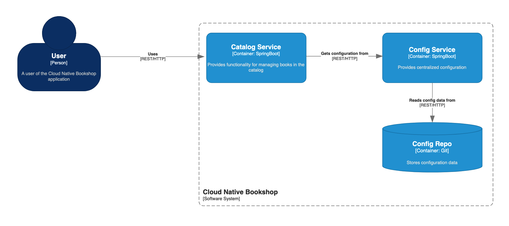

# cloud-native-bookshop
An umbrella repository for all the services of cloudnativebookshop.com

## In This Document:
1. [Repositories](#repositories)
2. [System Design](#system-design)
3. [Technologies Used](#technologies-used)

## Repositories
The Cloud Native Bookshop system contains the following services:
1. [catalog-service](https://github.com/shantdashjian/catalog-service)
2. [config-repo](https://github.com/shantdashjian/config-repo)

## System Design

## Technologies Use
1. Spring Boot
2. Spring Cloud Config Server
3. Spring Cloud Config Client

