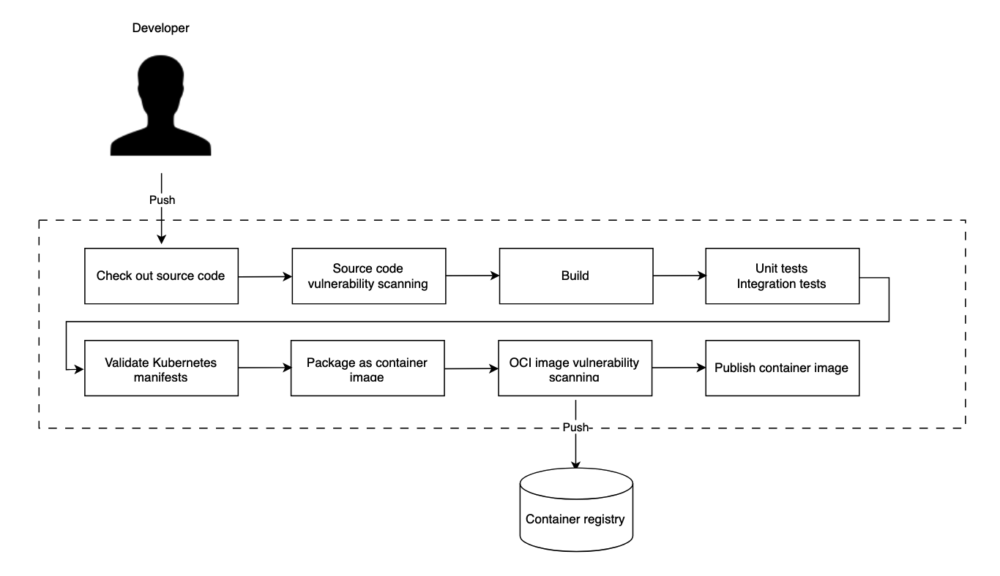

# Cloud Native Bookshop
An umbrella repository for all the services of cloudnativebookshop.com

## In This Document:
1. [Repositories](#repositories)
2. [System Design](#system-design)
3. [Technologies Used](#technologies-used)
4. [Deployment Pipeline](#deployment-pipeline)

## Repositories
The Cloud Native Bookshop system services are in the following repositories:
1. [edge-service](https://github.com/shantdashjian/edge-service)
2. [catalog-service](https://github.com/shantdashjian/catalog-service)
3. [order-service](https://github.com/shantdashjian/order-service)
4. [config-repo](https://github.com/shantdashjian/config-repo)
5. [config-service](https://github.com/shantdashjian/config-service)
6. [cloud-native-deployment](https://github.com/shantdashjian/cloud-native-deployment/tree/main)

## System Design

## Technologies Use
1. Spring Boot
2. Spring Cloud Config Server
3. Spring Cloud Config Client
4. Spring Data JDBC
5. Reactive Spring
6. Spring Cloud Gateway
7. PostgreSQL
8. Redis
9. GitHub Actions
10. Docker
11. Kubernetes

## Deployment Pipeline   

